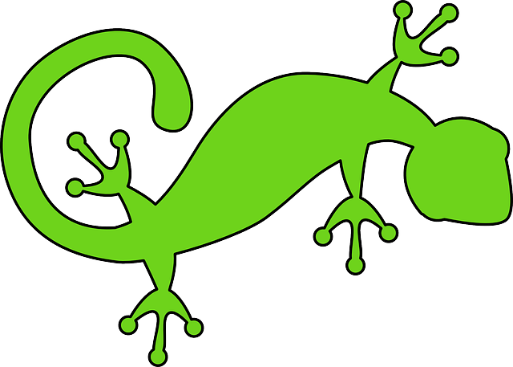

# GekkoRest App #

This is restaurant app, what has functionality to:

*seat the parties to the available table*

*view and edit party/create new*

*set the server*

*take an order*

*give a receipt with tax and tips*

*as chef you can see orders and set it as done*

*as an admin you can add servers and add/edit the food in restaurant*
 
## main page ##

## party view, where you can add order, see the status(ready/on the way) and see the total bill ##

##  Admin view, wher you can add the food item, edit or delete it, also you can hire new server!##

Enjoy the app!

#technologies used#
1. HTML5 & CSS3
2. Ruby on rails
3. Bootstrap
4. SQL/Database
5. Sinatra/ActiveRecord
